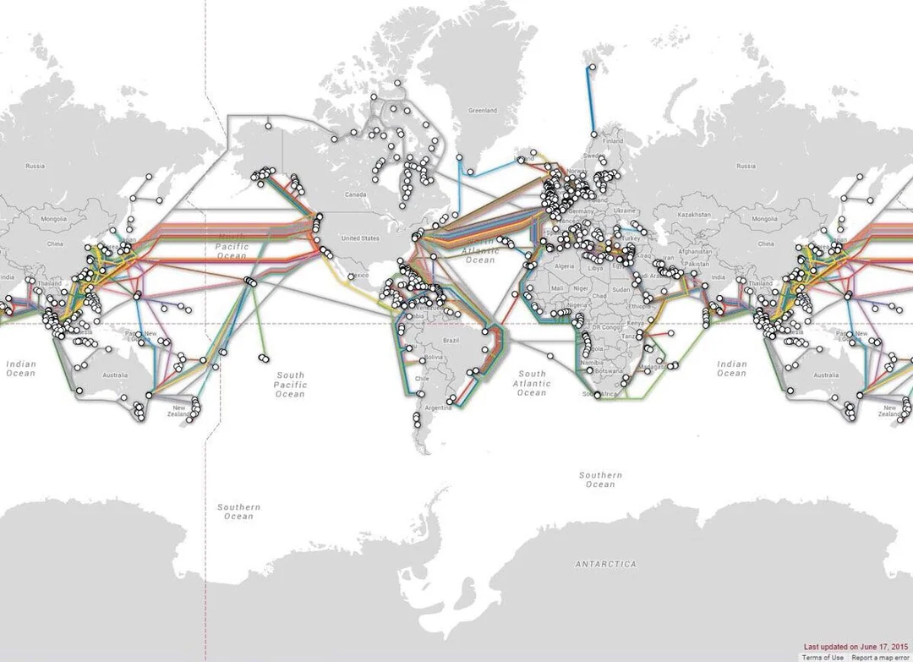

Charakteristika internetu, dostupné služby – www, e-mail, sociální sítě. Browser, technické prostředky připojení. Softwarové prostředky a pravidla pro tvorbu www stránek.

* Co je to internet?
* Z čeho se skládá internetová adresa?
* Vysvětlete pojmy http, https, ftp.
* Jmenujte druhy připojení běžného uživatele k internetu, jaké jsou jejich vlastnosti?

***

# Internet

Celosvětová *síť*, která *propojuje počítače* pomocí protokolu *TCP/IP*. Tato síť se skládá z *uzlů*, které spolu navzájem komunikují. Každý uzel má svoji přiřazenou veřejnou *IP adresu* (starší standard *IPv4*, dnes se přechází na novější *IPv6*, který má 1000x víc adres a používá šestnáctkovou soustavu), v jednotlivých *lokálních sítích* (LAN) má každé zařízení soukromou IP adresu přidělenou *DHCP serverem*. Abychom si vždy nemuseli pamatovat IP adresu stránky na kterou se chceme napojit, existují *DNS servery*, které přiřadí IP adrese doménu podle záznamu. Při každém požadavku na načtení stránky se tedy provede nejdříve *požadavek* do DNS serveru (anebo taky ne, pokud již jsme vyhledali v nedávné době, pak se sáhne do cache) a až poté se načítá stránka.

## Internetová adresa

Internetová adresa se jako celek skládá z:

* *Protokolu* - HTTP či bezpečnější HTTPS pro webové stránky, mohou být i jiné
* *Subdomény* - určuje větší celek stránky, příklad jsou mapy od společnosti Google (*maps*.google.com)
* *Domény* - textové označení pro stránku propojené s její IP adresou, musíme si zaregistrovat a koupit
* *Koncovky (TLD - Top Level Domain)* - specifikují typ a občas i jazyk stránky (jsou ale i výjimky - Tuvalu prodává .tv - využívá například Twitch)
* *Cesty* - označuje konkrétní podstránku, která se má načíst
* *Parametrů* - používají se ve formulářích pro předání dat další stránce, nebo mohou být uloženy v hlavičce požadavku
* Samozřejmě existuje více částí, které ale zas tolik nevidíme jako port, regionální TLD (.co.uk) či odkaz na anchor (část stránky - nadpisy, ...)
  

## Internetové protokoly

### HTTP

(= *Hyper Text Transfer Protocol*) přenáší logicky *hypertextové dokumenty*. To jsou nelineární kusy textu, které se navzájem propojují pomocí *hypertextových odkazů*. Klient požádá o načtení stránky a server mu pošle její obsah. Každý požadavek je samostatný a nemá informace o dalších poslaných

### HTTPS

(= *Hyper Text Transfer Protocol Secure*) je vylepšená verze HTTP, ve které se ale každý požadavek *šifruje* přes protokoly *TLS* či *SSL*. Pokud tedy naši komunikaci se serverem zachytí třetí strana, nebude mít šanci ji *rozluštit* a získat z ní *citlivá data*. Pokud chceme mít na stránce HTTPS, musíme si koupit *certifikát*

### FTP

(= *File Transfer Protocol*) slouží pro *přenos souborů* mezi dvěma počítači. Pokud tedy použijeme k tomu uzpůsobený *program* (WinSCP, FileZilla), můžeme na druhé zařízení soubory *nahrávat*, *stahovat* a měnit strukturu jako by to byl pouze disk. Mohou se nastavit *práva* (viz. [Počítačová síť](/notes/informatika/hotovo/počítačová-síť)) pro jednotlivé uživatele. Používá se například když si koupíme *hosting* webové stránky a potřebujeme na ní tu stránku dát. Spojení se *udržuje* až do zavření, aby byly informace vždy aktuální.

## Způsoby připojení

### Drátové připojení

Využívá *optického vlákna* či *ethernetového kabelu* (zdířka RJ-45) a je *nejrychlejší* a *nejstabilnější*. Ze všech má *nejvyšší* maximální *přenosovou rychlost* i *latenci*, protože signál nemusí putovat od routeru za roh a do jiné místnosti. Optické vlákno obvykle slouží na přenos na *větší vzdálenosti* (ulice, ale i mezi městy, pod oceány) a signál v něm putuje rychlostí cca $\dfrac{2}{3}$ rychlosti světla (tedy nějakých 200 000 km/s). Ethernetový kabel se poté používá pro rozvod v domácnosti

### Bezdrátové připojení

Využívá *satelity* a *antény* či síť *Wi-Fi*, je pomalejší, ale zato není limitováno počtem kabelů a zásuvek ve zdech, takže se na ně může snadno připojit více uživatelů. Používá se pro přenos *mezi obcemi* (kde se kvůli vzdálenosti a terénu nevyplatí kopat místo pro optiku) a v rámci *domácností*, ale i na *školách* či *veřejných místech*. Pokud chceme využívat, v zařízení musí být W-Fi čip (notebooky obvykle mají, ale třeba základní desky na vždycky - menší výrobní cena)

### Mobilní sítě

Fungují *bezdrátově* a umožňují komunikaci našeho *telefonu* s okolním světem. Šíří se pomocí *stožárů* a můžeme chytit *různé rychlosti* podle místa, kde se nacházíme. V lese tedy může být pomalý Edge, zatímco ve městech chytáme 4G a 5G.

## Jak vytvořit stránku?

Webovou stránku můžeme **vytvořit** buď přes *manuální psaní* HTML a CSS, pomocí publikačních systémů jako *WordPress*, nebo na specializovaných stránkách pro kompletní design, jako například *Wix* nebo *Framer*
