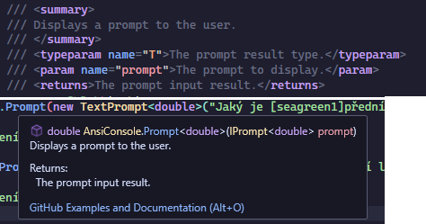

Charakteristika programu, deklarace, příkazy. Editor, kompilátor, typy chyb, hledání chyb.

* Vysvětlete pojmy deklarace, kompilace, zdrojový kód.
* Co znamená přenositelnost programu? Jmenujte zástupce přenositelných programovacích jazyků. 
* Jaké jsou nejčastější typy chyb při psaní programu? Co je breakpoint?
* Co to je a jak se značí komentář?

***

# Pojmy

## Deklarace

*Vytvoření proměnné*, funkce, metody atd. v programu po pozdější použití. Liší se od *definice* - ta určuje obsah, hodnotu

## Kompilace

(= sestava, sestavení) je *převedení kódu* do podoby, která je *nečitelná pro nás*, ale čitelná pro počítač, obecně z jazyka *vyššího* do jazyka *nižšího*. Vytvoří spustitelný program, do kterého ale nemůžeme nahlédnout, potřebujeme nějaký *dekompilátor*.

## Zdrojový kód

Textový soubor, ve kterém je čitelný kód programu před tím, než je zkompilován, opakem je *strojový kód* - zkompilován

## Přenositelnost programu

(= kompatibilita) znamená, jak snadno lze program spustit na různých operačních systémech bez dalších úprav. Pokud jsou náklady na *portování (upravení pro funkci na jinou platformu)* menší, než kompletní přepsání, nazýváme tento software *portabilní*. Mezi portabilní jazyky se řadí například *C, Java*

# Chyby

Při psaní můžeme dělat *chyby*, pokud jsme nepozorní. Moderní programovací editory ale na ně umí *upozornit* a rovnou navrhnout i *řešení*.

## Syntaktická chyba

Jedna z nejčastějších a zároveň nejjednodušších. Stane se, když se *poruší "pravopis"* programovacího jazyka, například když zapomeneme přidat na konec řádku *středník*, neuvedeme text v uvozovkách, ...

## Chyba při běhu

Editor nás na tuto chybu obvykle hned neupozorní. Stane se, pokud při běhu programu nastane nějaká *neočekávaná událost*, například chceme získat přístup k prvku, který je *mimo rozsah* pole, nebo přetypovat dva nekompatibilní typy proměnných. Tyto chyby *shodí* běžící program, pokud nejsou nějak *ošetřeny* (`try..catch`)

## Logická chyba

Kód se zkompiluje a proběhne bez chyb, ale výsledek není takový, jaký bychom chtěli. Příkladem je fenomén *off-by-one error* (například začneme počítat prvky pole o 1 větší, než bychom chtěli). Ve velkých a komplexních programech se může *těžko řešit*. Další příklad je například *nekonečný cyklus* - špatně napíšeme podmínku a může se stát, že se bude cyklus *opakovat do nekonečna*, nebo dokud program *nespadne*

## Ladění

Většina editorů má v dnešní době i funkci zvanou *debugování (ladění)*. Ta umožňuje na každou řádku vložit *breakpoint* (obvykle značený červeným kruhem - 🔴). Jakmile se program při běhu na tuto řádku dostane, *zastaví se* a umožňuje uživateli zjistit, co je s kódem špatně. Jde například získat *hodnota proměnných* v daném bodě běhu a *postupně po řádcích pokračovat*

# Komentáře

Do kódu lze také přidávat *komentáře*. Ty jsou ignorovány kompilátorem a nevyskytují se ve finálním programu, ale umožňují přidat poznámky pro programátory.

## Jednořádkový komentář

Používá se obvykle pro kratší komentáře či poznámky. Je to veškerý text mezi *dvojitými lomítky - //* a *koncem řádky*, lze tedy napsat i za příkazy.

```cs
Console.WriteLine("Ahoj"); // Vypíše slovo "ahoj"
```

## Víceřádkový komentář

Používá se pro delší komentáře či poznámky. Je to veškerý text mezi *začátkem komentáře - /\** a *koncem komentáře - \*/* .

```cs
/* Následující kód
vypíše slovo "ahoj" */
Console.WriteLine("Ahoj");
```

Jednořádkové komentáře by také šly zapsat tímto způsobem, je to ale nepraktické

## Dokumentační komentáře

Používají se, pokud chceme nějak *zdokumentovat* funkci tak, aby to mohl editor ukázat *dalšímu programátorovi*, který jí bude chtít použít. Mají svůj *speciální syntax* a *tagy*, např. pro souhrn, popis parametrů, tabulky, příklady. Jde jsou uvedeny spíše jako zajímavost

