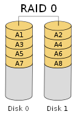

Principy zápisu dat na datová média. Datová úložiště. Zálohování dat.

* Jaké jsou typy záznamových médií z hlediska principu záznamu?
* Co je to datové úložiště? Vysvětlete rozdíl mezi NAS a cloud.
* Jakými způsoby dochází ke ztrátě dat a jak lze minimalizovat tato rizika? 
* Vysvětlete pojem RAID.

***

# Princip záznamu na disk

## Využívající magnety

Na povrchu jsou části, které se dají *zmagnetizovat* pomocí nějaké *hlavice* -> jsou náchylné na *elektromagnetické jevy*; dříve se tato technologie používala v *disketách* a *magnetických páskách*, dnes ji najdeme v *HDD*

## Využívající optický záznam

Data jsou uložena na *disku* ve *spirále*. Při čtení se používá *laser*, který detekuje buď malé *drážky* (1) nebo *nic* (0). Data jsou náchylná na poškození, pokud povrch *poškrábeme* -> tím si efektivně vytvoříme svoje drážky, dnes najdeme na *CD*, *DVD* a *Blu-Ray* discích

## Využívající elektronický záznam

Data jsou uložena *elektronicky*, je ze všech tří typů *nejrychlejší* a zároveň *nejodolnější* (nejsou zde žádné pohyblivé části), ale zase horší životnost, dnes se používá na *SSD*, *Flash Disky* a *Paměťové karty (SD)*

# Datové úložiště

**Datové úložiště** je nějaký *systém*, který je vytvořen pro *uchovávání většího množství dat* a ke snadnému přístupu k nim přes internet. Dělí se na:

* **NAS** - hostované *lokálně* (na domácí síti), k použití je potřeba si koupit příslušný *hardware* a ten poté nastavit -> ne pro normálního uživatele
* **Cloud** - hostován *externě někým jiným*, my si pouze kupujeme licenci, plán; některé služby nabízejí i plány zdarma - *OneDrive, Google Drive*

# Ztráta dat

## Hardwarová chyba

Fyzicky nám médium selže. Ať už to je *poškrábání CD disku* nebo *spadnutí hard disku*. **Prevence** je prostě být opatrný

## Softwarová chyba

Pokud se zrovna zapisuje do souboru a program *spadne*, nebo disk *fyzicky odpojíme*, může dojít k *neúplnému zápisu* nebo *přepisu* - data jsou pak částečně *poškozená*. **Prevence** je *nevypínat počítač* pokud např. pracuje na aktualizacích nebo *nevytahovat disky* za *provozu* (pravé tlačítko -> bezpečně vysunout)

## Chyba uživatele

Omylem se při vymazávání *překlikneme* a smažeme *špatný soubor* (obvykle se dá *obnovit* z koše), nebo si do počítače např. vylijeme vodu. **Prevence** je opět být opatrný

## Zlé živly

Stáhneme si vir *ransomware* (nebo jiný), který nám *zašifruje data* a očekává zaplacení, aby mám poskytl *dešifrovací klíč*. **Prevence** je dávat si pozor na to, co stahujeme. Vhodné je také použití *antivirů*

* Vždy je ale nejlepší **prevence** si data *pravidelně zálohovat* na separátní disk (buď manuálně, nebo na to existují specializované programy)

# RAID

Metoda, jak *chránit svá data* na pevném disku před fyzickým selháním, která se obvykle používá ve velkých *datacentrech* (můžeme si ji ale zapnout i u nás doma). Spočívá v tom, že několik disků máme v tzv. *RAID poli* a data se *propisují* na *všechny disky* v tomto poli. Pokud jeden z nich *selže*, upozorní na to administrátora. V tomto stavu jsou všechna data *stále k dispozici*, celé pole jenom běží ve *sníženém výkonu*. Jakmile se dovnitř dá nový disk (nebo pole již obsahuje *rezervní* -> vše probíhá *automaticky*), na disk se dopočítají data (rekonstrukce) a poté je pole znovu *synchronizováno*. Jsou různé druhy RAID, přes *RAID 0* (není skutečný RAID, neprobíhá zde duplicita dat mezi disky, data se střídavě zapisují na jeden a druhý disk), *RAID 1* (dva disky, do kterých se zapisují stejná data) až k modernímu *RAID 6* (nejsložitější, potřebujeme minimálně 4 disky)
    
